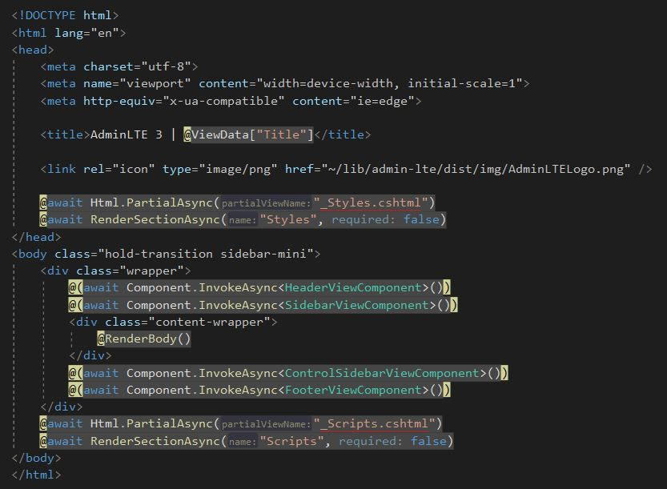
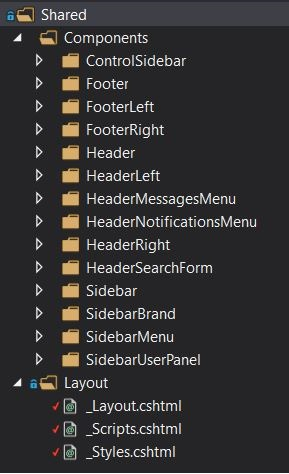
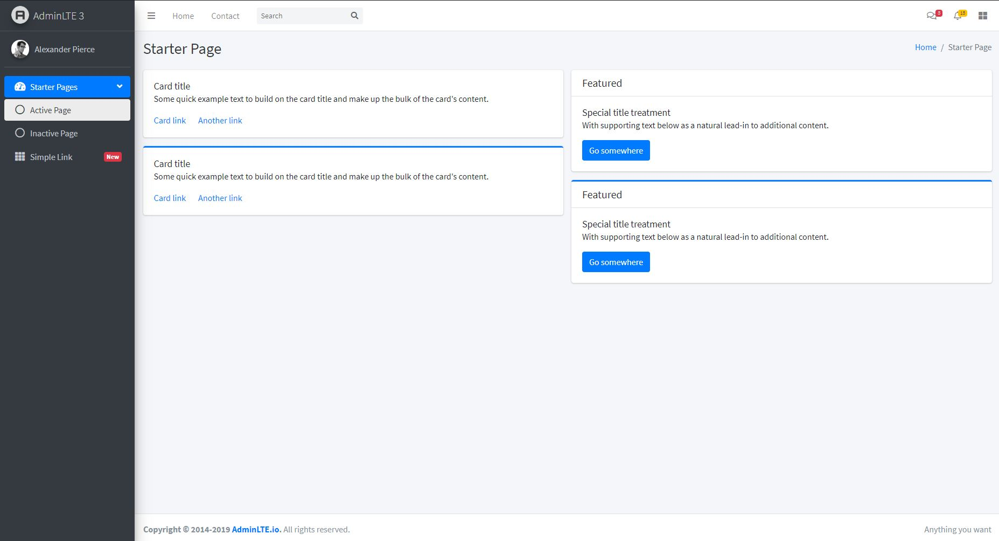

# admin-lte-dotnet

This repo shows how to implement layout and starter page of [AdminLTE v3](https://github.com/ColorlibHQ/AdminLTE) for dotnet technologies [MVC Core](https://docs.microsoft.com/tr-tr/aspnet/core/mvc), [Razor Pages](https://docs.microsoft.com/tr-tr/aspnet/core/razor-pages) and [Tag Helpers](https://docs.microsoft.com/tr-tr/aspnet/core/mvc/views/tag-helpers). I did layout implementation as modular as possible to control it better. I hope you guys can learn something from my approach. 

#### Layout

#### Layout Structure

#### Starter Page

